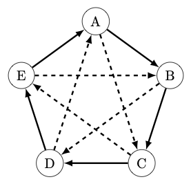
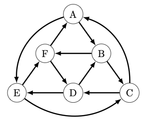

# Balanced Non-Transitive Dice
Finding balanced sets of non-transitive dice using a SAT solver.

This project relies heavily on the Python module `pysat` and its optional dependencies `pblib` and `aiger`.
The simplest way to get and start using `pysat` is to install the latest stable release of the toolkit from PyPI:
```
$ pip install python-sat[pblib, aiger]
```

## Interesting Three-Dice Sets
The most interesting set of three dice that I've found is:

|       | i   | ii  | iii | iv  | v   | vi  | vii | viii | ix  | x   | xi  | xii | xiii |
| :-:   | --: | --: | --: | --: | --: | --: | --: | --:  | --: | --: | --: | --: | --:  |
| **A** | 0   | 0   | 0   | 0   | 2   | 5   | 5   | 5    | 5   | 5   | 5   | 5   | 5    |
| **B** | 4   | 4   | 4   | 4   | 4   | 4   | 4   | 4    | 4   | 4   | 4   | 4   | 4    |
| **C** | 1   | 3   | 3   | 3   | 3   | 3   | 3   | 3    | 6   | 6   | 6   | 6   | 6    |

Notice that:
  - P{A > B} = P{B > C} = P{C > A} = 8/13

This example is interesting because it settles a conjecture posed in
the paper [Possible Probability and Irreducibility of Balanced Non-Transitive Dice](https://arxiv.org/pdf/2006.12866.pdf) by Injo Hur and Yeansu Kim.
In that paper, the author's conjecture that the bias of a balanced set of dice is bounded above by 11/18. Because 11/18 < 8/13 this set provides a counterexample.

In fact, this set of dice suggests an entire family of increasingly strong counterexamples.
If we let $F_n$ be the $n_{th}$ Fibonacci number, with $F_1 = F_2 = 1$,  then there is a set of $F_{2n+1}$-sided dice that have bias $F_{2n} / F_{2n+1}$. One way to construct such as set is
  - **A** = $[0] * (F_{2n - 1} - 1) + [2]*1 + [5] * F_{2n}$
  - **B** = $[4] * F_{2n+1}$
  - **C** = $[1] * 1 + [3] * (F_{2n} - 1) + [6] * F_{2n-1}$

It is clear that P{A > B} = P{B > C} = $(F_{2n+1}F_{2n}) / F_{2n+1}^2$.
To complete the proof we use Cassini's Identity to conclude that
$$ F_{2n-1}F_{2n+1} = F_{2n}^2 + 1.$$
Therefore we have

P{C > A} = $\frac{F_{2n-1}F_{2n+1} + (F_{2n-1} - 1) + (F_{2n} - 1)F_{2n-1}}{F_{2n+1}^2}$

P{C > A} = $\frac{(F_{2n}^2 + 1) + F_{2n}F_{2n-1} -1}{F_{2n+1}^2}$

P{C > A} = $\frac{F_{2n}(F_{2n} + F_{2n-1})}{F_{2n+1}^2}$

P{C > A} = $\frac{F_{2n+1}F_{2n}}{F_{2n+1}^2}.$

Recall that $F_5 = 5$, $F_6 = 8$, and $F_7 = 13$. Therefore the set of 13-sided dice
described above above follows this pattern with $n = 3$.

## Interesting Four-Dice Sets
The most interesting set of four dice that I've found is:

|       | i   | ii  | iii | iv  |
| :-:   | --: | --: | --: | --: |
| **A** | 0   | 4   | 7   | 7   |
| **B** | 3   | 3   | 6   | 6   |
| **C** | 2   | 2   | 5   | 9   |
| **D** | 1   | 1   | 8   | 8   |

Notice that:
  - P{A > B} = P{B > C} = P{C > D} = P{D > A} = 5/8
  - P{A > C} = P{B > D} = 1/2

So, we have a nontransitive cycle of length four and the dice that are not adjacent in that cycle are evenly matched.

The following table describes the probability that the die in each row beats the die in each column.

|       | A   | B   | C   | D   |
| :-:   | :-: | :-: | :-: | :-: |
| **A** |  x  | 5/8 | 4/8 | 3/8 |
| **B** | 3/8 |  x  | 5/8 | 4/8 |
| **C** | 4/8 | 3/8 |  x  | 5/8 |
| **D** | 5/8 | 4/8 | 3/8 |  x  |

Contrast this set with [Efron's Dice](https://en.wikipedia.org/wiki/Intransitive_dice#Efron's_dice). In that set, while the bias on the balanced nontransitive cycle is stronger, only one of the two nonadjacent pairs are evenly matched.

## Interesting Five-Dice Sets
The most interesting set of five dice that I've found is:
|       | i   | ii  | iii | iv  | v   | vi  |
| :-:   | --: | --: | --: | --: | --: | --: |
| **A** | 0   | 0   | 9   | 9   | 9   | 9   |
| **B** | 2   | 6   | 8   | 8   | 8   | 8   |
| **C** | 5   | 5   | 5   | 5   | 7   | 11  |
| **D** | 4   | 4   | 4   | 4   | 13  | 13  |
| **E** | 1   | 3   | 3   | 10  | 10  | 12  |

Notice that:
  - P{A > B} = P{B > C} = P{C > D} = P{D > E} = P{E > A} = 2/3
  - P{A > C} = P{C > E} = P{E > B} = P{B > D} = P{D > A} = 5/9

So, we have two balanced cycles with different biases. Furthermore the biases are related in such a way that each die is:
  - very strong against one die with P{X > X+1} = 6/9.
  - moderately strong against one die with P{X > X+2} = 5/9.
  - moderately weak against one die with P{X > X+3} = 4/9.
  - very weak against one die with P{X > X+4} = 3/9.

The following table describes the probability that the die in each row beats the die in each column.

|       | A   | B   | C   | D   | E   |
| :-:   | :-: | :-: | :-: | :-: | :-: |
| **A** |  x  | 6/9 | 5/9 | 4/9 | 3/9 |
| **B** | 3/9 |  x  | 6/9 | 5/9 | 4/9 |
| **C** | 4/9 | 3/9 |  x  | 6/9 | 5/9 |
| **D** | 5/9 | 4/9 | 3/9 |  x  | 6/9 |
| **E** | 6/9 | 5/9 | 4/9 | 3/9 |  x  |

We can represent these relationships in a diagram with two different edge weights.  Here a solid arrow from X to Y indicates that P{X > Y} = 2/3 while a dashed arrow from X to Y indicates that P{X > Y} = 5/9.




## Interesting Six-Dice Sets
The most interesting set of six dice that I've found is:
|       | i   | ii  | iii | iv  | v   | vi  |
| :-:   | --: | --: | --: | --: | --: | --: |
| **A** | 0   | 2   | 12  | 12  | 14  | 22  |
| **B** | 6   | 6   | 8   | 10  | 10  | 19  |
| **C** | 3   | 5   | 5   | 17  | 17  | 17  |
| **D** | 1   | 1   | 11  | 13  | 15  | 21  |
| **E** | 7   | 7   | 7   | 9   | 9   | 20  |
| **F** | 4   | 4   | 4   | 16  | 18  | 18  |

Notice that:
  - P{X > X + 1} = 7/12
  - P{X > X + 2} = 5/12
  - P{X > X + 3} = 6/12
  - P{X > X + 4} = 7/12
  - P{X > X + 5} = 5/12

In particular, these dice have the property that for all X,Y,Z such that
X -> Y -> Z, we have Z -> X.

If we suppress edges between dice that are evenly matched, then we can represent these relationships with a diagram with eight interlocking three-dice sets, (A,B,C), (B,C,D), (C,D,E), (D,E,F), (E,F,A), (F,A,B), (A,E,C), and (B,F,D).



## Interesting Nineteen-Dice Sets (?!?)
I found an interesting set of nineteen five-sided dice with the property that
for any set of three of the dice (**X**, **Y**, **Z**) there is a fourth die **W**
such that P{W > X} = P{W > Y} = P{W > Z} = 13/25.

|       | i   | ii  | iii | iv  | v   |
| :-:   | --: | --: | --: | --: | --: |
| **A** | 0   | 31  | 39  | 73  | 92  |
| **B** | 14  | 33  | 56  | 61  | 71  |
| **C** | 6   | 7   | 48  | 86  | 88  |
| **D** | 22  | 36  | 41  | 60  | 76  |
| **E** | 4   | 10  | 58  | 72  | 91  |
| **F** | 23  | 24  | 50  | 57  | 81  |
| **G** | 11  | 30  | 47  | 69  | 78  |
| **H** | 19  | 29  | 45  | 59  | 83  |
| **I** | 27  | 35  | 40  | 54  | 79  |
| **J** | 3   | 21  | 37  | 84  | 90  |
| **K** | 1   | 20  | 55  | 66  | 93  |
| **L** | 18  | 38  | 44  | 65  | 70  |
| **M** | 5   | 17  | 51  | 68  | 94  |
| **N** | 2   | 26  | 43  | 75  | 89  |
| **O** | 9   | 15  | 52  | 74  | 85  |
| **P** | 8   | 34  | 53  | 63  | 77  |
| **Q** | 16  | 28  | 49  | 62  | 80  |
| **R** | 13  | 25  | 46  | 64  | 87  |
| **S** | 12  | 32  | 42  | 67  | 82  |
